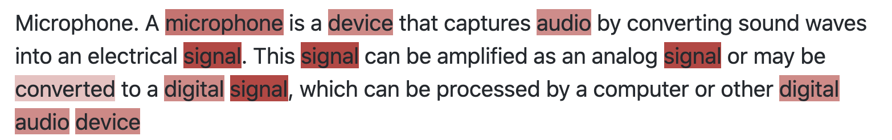

# Highlighting for Answers to Non-Factoid Questions

This repository contains code for the following paper:

>[Do People and Neural Nets Pay Attention to the Same Words: Studying Eye-Tracking Data for Non-Factoid QA Evaluation" published at CIKM '20](http://marksanderson.org/publications/my_papers/CIKM__Do_People_and_Neural_Networks_Pay_Attention_to_the_Same_Words_.pdf)  
> Valeriia Bolotova, Vladislav Blinov, Yukun Zheng, W. Bruce Croft, Falk Scholer, Mark Sanderson
> ACM International Conference on Information and Knowledge Management (CIKM), 2020


## Installation

From source:

    git clone git@github.com:Lurunchik/non-factoid-answer-highlighting.git
    cd non-factoid-answer-highlighting
    pip install poetry>=1.0.5
    poetry install
    poetry shell

## Highlighter usage

You can import the highlighter to run on your texts as shown in the [example Jupyter notebook](https://github.com/Lurunchik/non-factoid-answer-highlighting/blob/master/example.ipynb).

Creating a highlighter object:
```python
from highlighting.highlighter import BertHighlighter
highlighter = BertHighlighter.from_pretrained()
```

Highlighting an answer:
```python
from IPython.core.display import HTML, display

html = highlighter.highlight(
    question = 'What is a computer microphone?',
    answer = '''Microphone. A microphone is a device that captures audio by converting sound waves into an electrical signal. This signal can be amplified as an analog signal or may be converted to a digital signal, which can be processed by a computer or other digital audio device''',
)
display(HTML(html))
```

 

You can also use a commandline to highlight your answer by giving a question and an answer

```bash 
python -m highlighting highlight "Why is life so hard?" "God knows, my friend"
```

## Model training
Load and prepare training data:
```bash 
python -m highlighting load_dataset
```
Run traning
```bash 
python -m highlighting train
```


## Citation

```bibtex
@inproceedings{10.1145/3340531.3412043,
    author = {Bolotova, Valeria and Blinov, Vladislav and Zheng, Yukun and Croft, W. Bruce and Scholer, Falk and Sanderson, Mark},
    title = {Do People and Neural Nets Pay Attention to the Same Words: Studying Eye-Tracking Data for Non-Factoid QA Evaluation},
    year = {2020},
    isbn = {9781450368599},
    publisher = {Association for Computing Machinery},
    address = {New York, NY, USA},
    url = {https://doi.org/10.1145/3340531.3412043},
    doi = {10.1145/3340531.3412043},
    abstract = {We investigated how users evaluate passage-length answers for non-factoid questions. We conduct a study where answers were presented to users, sometimes shown with automatic word highlighting. Users were tasked with evaluating answer quality, correctness, completeness, and conciseness. Words in the answer were also annotated, both explicitly through user mark up and implicitly through user gaze data obtained from eye-tracking. Our results show that the correctness of an answer strongly depends on its completeness, conciseness is less important.Analysis of the annotated words showed correct and incorrect answers were assessed differently. Automatic highlighting helped users to evaluate answers quicker while maintaining accuracy, particularly when highlighting was similar to annotation. We fine-tuned a BERT model on a non-factoid QA task to examine if the model attends to words similar to those annotated. Similarity was found, consequently, we propose a method to exploit the BERT attention map to generate suggestions that simulate eye gaze during user evaluation.},
    booktitle = {Proceedings of the 29th ACM International Conference on Information & Knowledge Management},
    pages = {85–94},
    numpages = {10},
    keywords = {answer interaction, non-factoid question answering, eye tracking, information-seeking, user behaviour analysis, answer presentation, user interaction},
    location = {Virtual Event, Ireland},
    series = {CIKM '20}
}    
```
